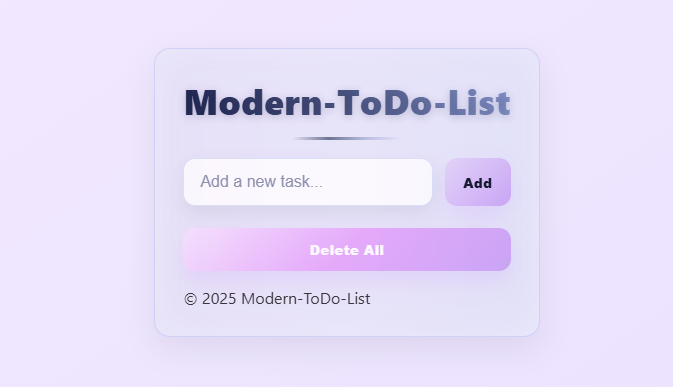

# 📝 Modern To-Do List (React + Vite)

A beautifully designed and fully functional **To-Do List Application** built with **React**, styled with **modern CSS gradients**, and powered by **Vite** for blazing-fast performance.

---

## ✨ Features
✅ Add, complete, and delete tasks easily  
💾 Save tasks in local storage (persistence even after refresh)  
🎨 Responsive modern UI with elegant colors  
🧩 Clean and well-structured React components  
⚡ Built with Vite for high-speed development  

---

## 🛠️ Technologies Used
- ⚛️ **React (Hooks, Components, JSX)**
- ⚡ **Vite (Modern Build Tool)**
- 🎨 **CSS (custom gradients + Flexbox)**
- 💾 **LocalStorage API**

---

## 🌈 Preview


---

## 🚀 Installation

```bash
# Clone this repository
git clone https://github.com/hajjarizadehSiavash/modern-todo-list.git

# Navigate into the folder
cd modern-todo-list

# Install dependencies
npm install

# Run the app locally
npm run dev

---

## 👨‍💻 Author  

**Siavash Hajjarizadeh**  
💼 Frontend Developer | React Enthusiast  
📍 Based in Germany 🇩🇪  
✉️ Contact: [developersiavash@gmail.com]  

---

⭐ If you like this project, please give it a star on GitHub! 🌟
